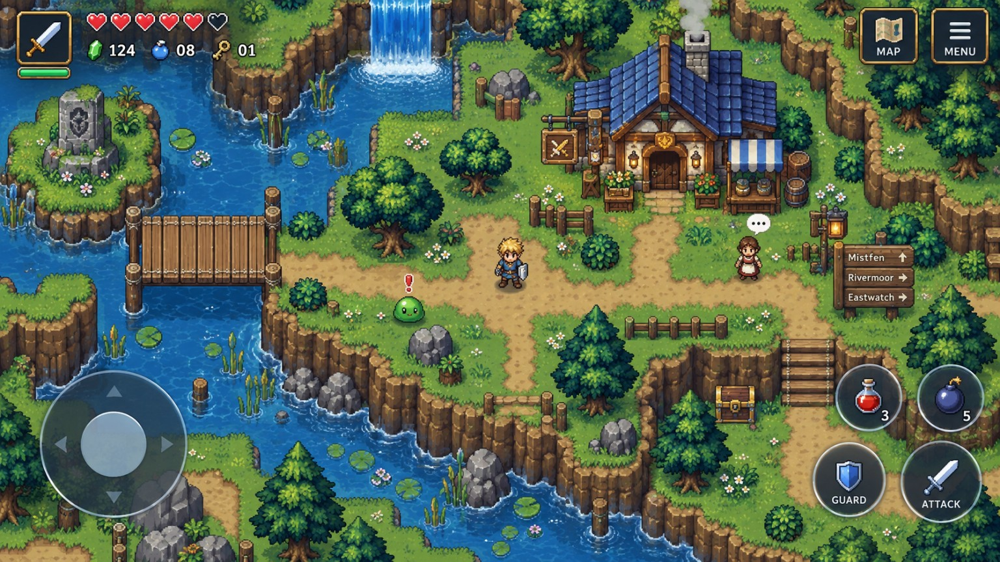
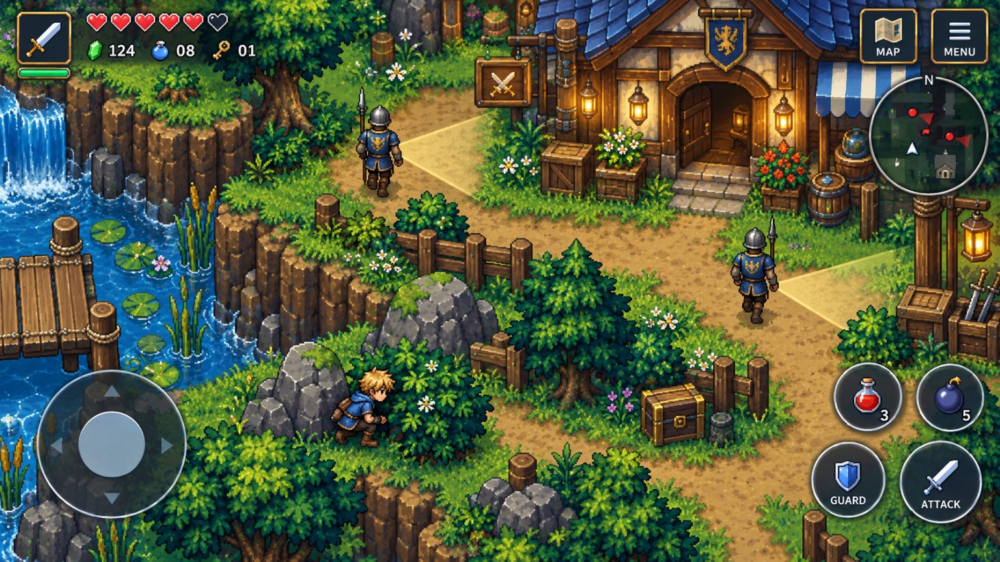
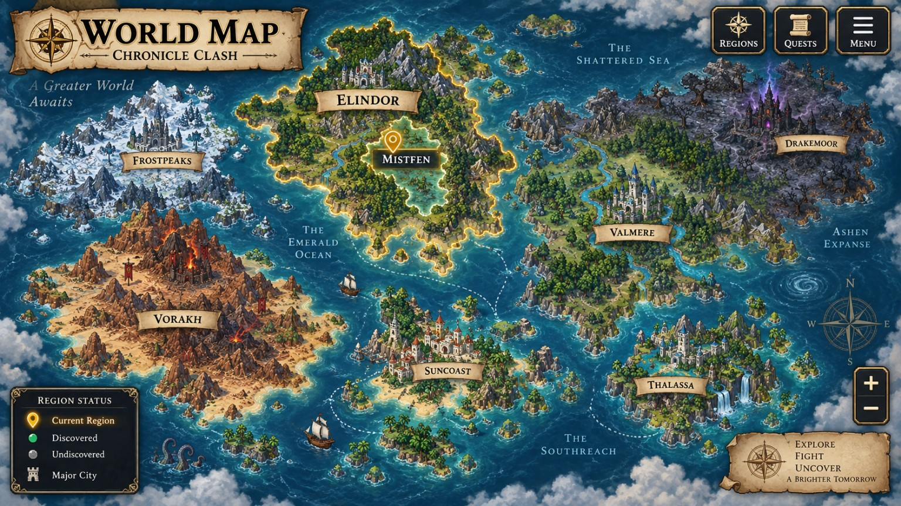
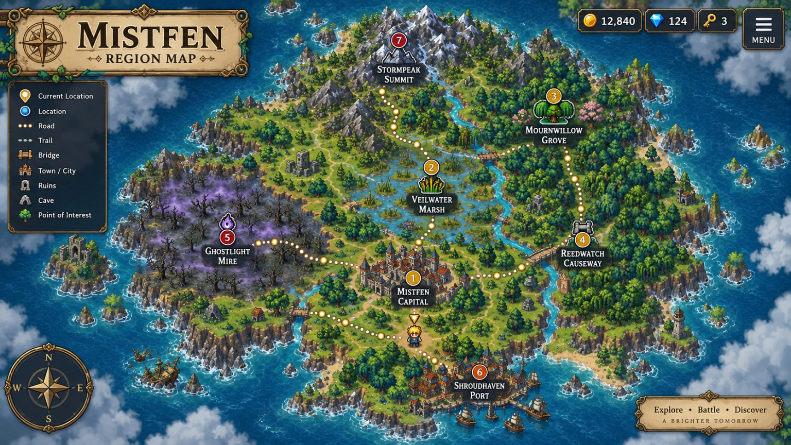
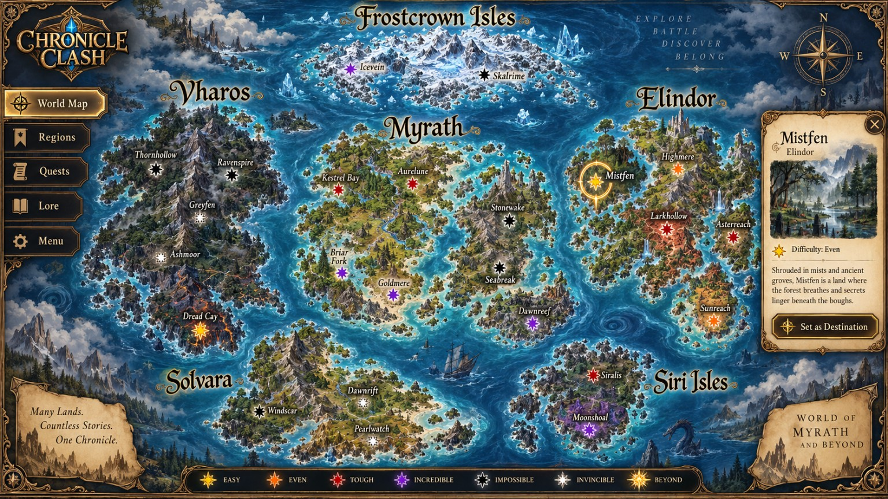
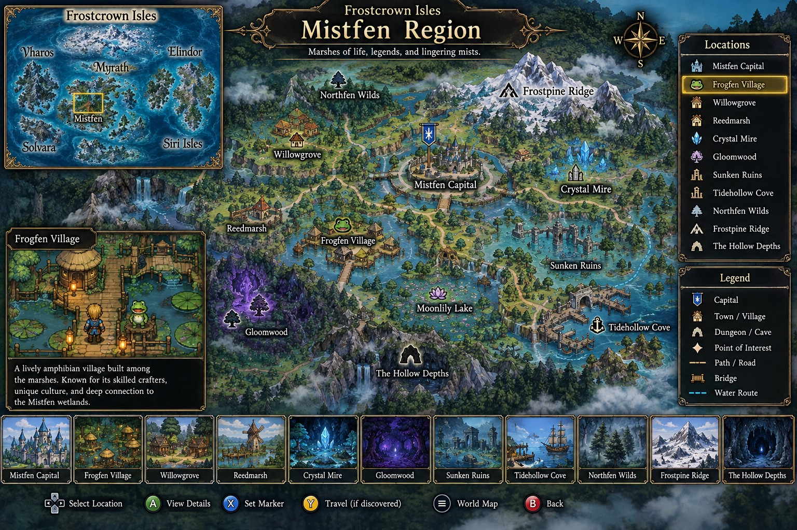
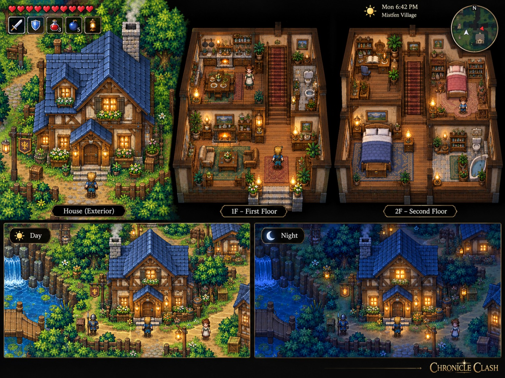
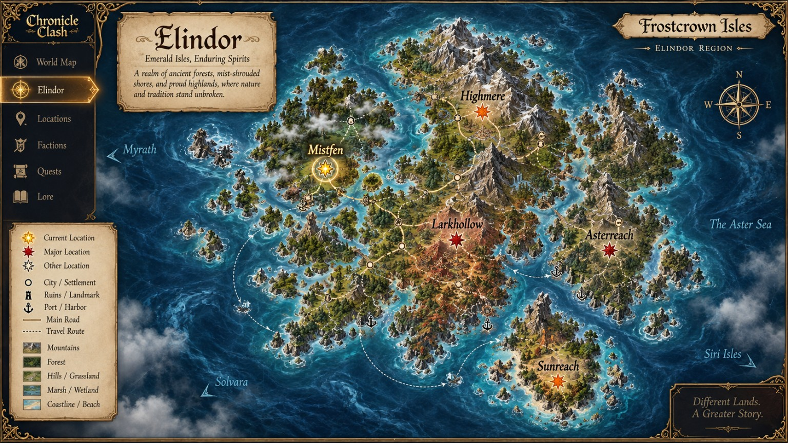

# Evertrail — Gameplay Vision

Evertrail is an original top-down action-RPG focused on exploration, combat, stealth, world travel, towns, interiors, and expandable adventure systems. These images represent the projected gameplay and visual direction as development moves forward.

_These are vision and reference images, not screenshots of the current build. Not every feature shown is implemented yet._

| | |
| --- | --- |
|  **Core Gameplay** Top-down action-RPG exploration and combat |  **Stealth Systems** Patrols, detection, and infiltration |
|  **World Map Travel** Large-scale navigation between regions |  **Region Maps** Towns, roads, landmarks, and dungeons |
|  **Location Selection** Moving from world view into playable areas |  **Living Environments** Villages, houses, interiors, and NPC spaces |
|  **Day/Night Presentation** Changing atmosphere across locations |  **Expandable Foundation** Systems designed to grow over time |
